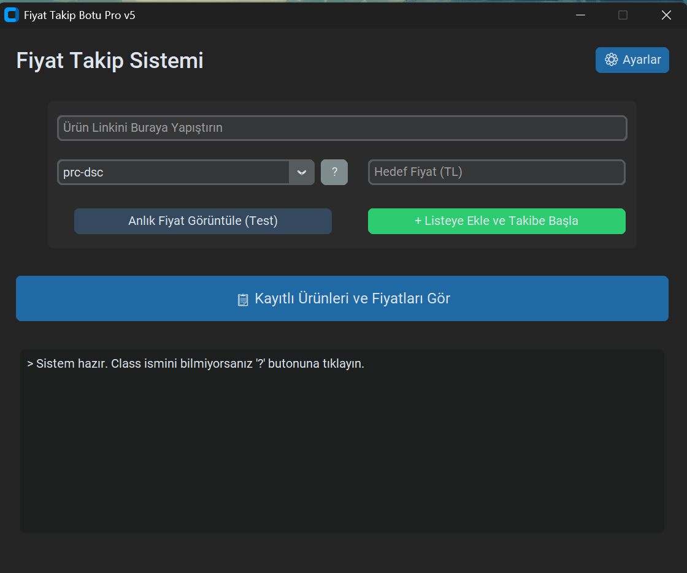
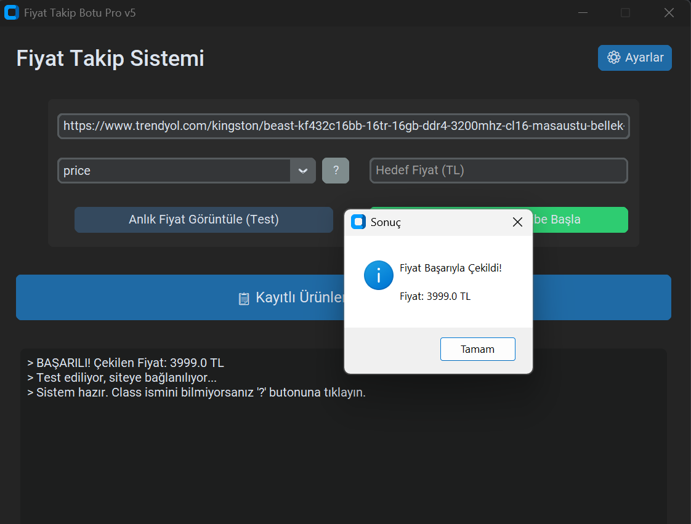
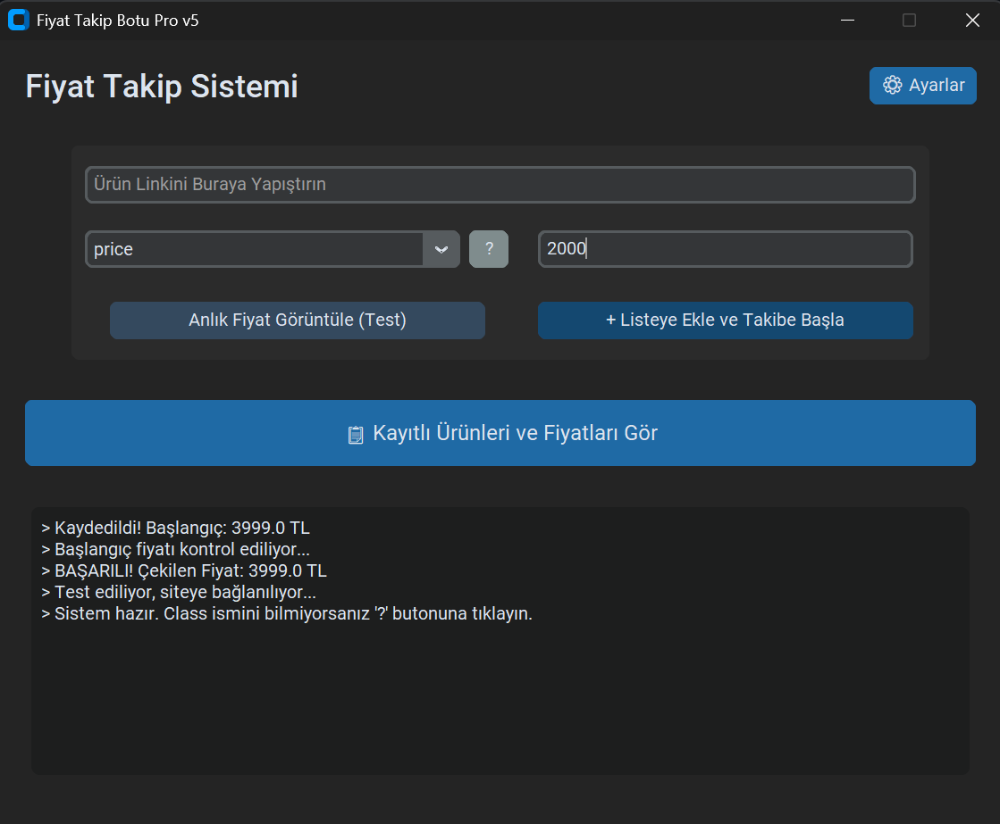
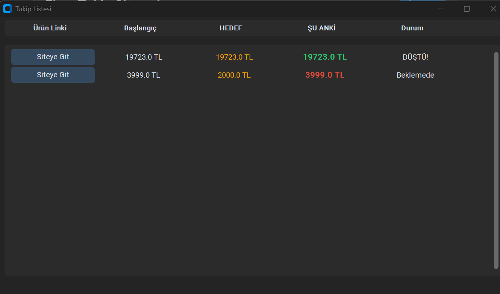

🛒 Fiyat Takip & Alarm Botu

E-ticaret sitelerindeki (Amazon, Trendyol, Hepsiburada vb.) ürünlerin fiyatlarını anlık olarak takip eden, hedeflediğiniz fiyata düştüğünde size e-posta ile bildirim gönderen masaüstü uygulamasıdır.


---

## 📥 İndir ve Kullan (Kurulumsuz - .exe)

Python veya kod bilgisine ihtiyacınız yok! Hazır programı indirip hemen kullanmaya başlayabilirsiniz.

1.  **[Buraya Tıklayarak En Son Sürümü İndirin]([BURAYA_RELEASES_LINKI_GELECEK](https://github.com/firatozer01/fiyat-takip-botu-web-scraping/releases/download/v5.0/FiyatTakipBotu_v0.5.zip))** (v5.0.zip).
2.  İndirdiğiniz `.zip` dosyasını klasöre çıkartın.
3.  İçindeki **`FiyatTakipBotu.exe`** dosyasını çalıştırın.
4.  Hepsi bu kadar! Program kendi veritabanını otomatik oluşturacaktır.

---

## 💻 Geliştirici Kurulumu (Kaynak Kod)

Eğer kodları incelemek veya geliştirmek isterseniz aşağıdaki adımları izleyebilirsiniz.

### Gereksinimler
* Python 3.10 veya üzeri
* Git

### Adım Adım Kurulum

1.  **Projeyi Klonlayın:**
    ```bash
    git clone [https://github.com/KULLANICI_ADIN/repo-ismin.git](https://github.com/KULLANICI_ADIN/repo-ismin.git)
    cd repo-ismin
    ```

2.  **Kütüphaneleri Yükleyin:**
    ```bash
    pip install -r requirements.txt
    ```

3.  **Uygulamayı Başlatın:**
    ```bash
    python main.py
    ```

---

## 🌟 Özellikler

* **Modern Arayüz:** Göz yormayan "Dark Mode" tasarımı.
* **Akıllı Class Seçici:** CSS Class mantığı ile her sitede çalışır.
* **Anlık Test:** Kaydetmeden önce fiyatın doğru çekilip çekilmediğini test etme imkanı.
* **E-Posta Bildirimi:** Hedef fiyata ulaşıldığında otomatik mail atar.
* **JSON Veritabanı:** Kurulum gerektirmeyen, taşınabilir yerel kayıt sistemi.

## ⚙️ Ayarlar (Mail Gönderimi İçin)

Uygulama üzerinden mail alabilmek için sağ üstteki **Ayarlar** menüsünden Gmail bilgilerinizi girmeniz gerekir.

> **Güvenlik Notu:** Google hesabınızın normal şifresi çalışmaz. Google Hesap Ayarları > Güvenlik > 2 Adımlı Doğrulama > Uygulama Şifreleri kısmından alacağınız 16 haneli şifreyi kullanmalısınız. Bilgileriniz sadece kendi bilgisayarınızda saklanır.

## 📸 Ekran Görüntüleri









---
**Geliştirici:** [Ali Fırat Özer]
